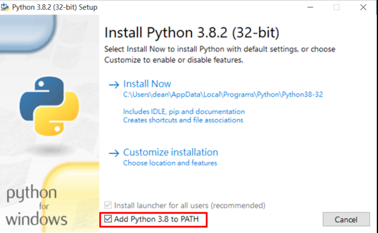

# Real-time-Brainwave-Car-Controller

## working environment
  1. computer with windows OS(cygnus can only be run on windows OS)
  2. cygnus<br>
    - [Link](https://drive.google.com/file/d/1sH7X4EFP8hUWEHtPcJr0E_8npi1PI3sR/view)
  3. python 3<br>
    - [Link](https://www.python.org/downloads/)<br>
    - when installing python, remember to select the enable path option<br>
     <br>
    - Please install python first as much as possible, because python have many installed tool and library like pip。
  4. openvibe<br>
    - [Link](http://openvibe.inria.fr/downloads/)
  
  5. python Library installation<br>
     Type the following command in cmd<br>
    ```
    pip install pylsl
    ```<br>
    ```
    pip install easytello
    ```<br>
    You can have cmd screen by typing "cmd" in windows search<br>
     Or execute[install_python_library.bat](https://github.com/catagain/Real-time-Brainwave-Car-Controller/blob/main/install_python_library.bat)  file.
    
    
## 
